# 第**1**章 **Git** 概述 

## 0 容易遗忘的问题点

1. [^1]:Git工作区的分类及作用 `工作区`，`暂存区`，`本地库`，`远程仓库`及相关提交指令

2. [^2]:Git切换版本，用的是底层的master指针 指向了指定的版本

3. [^3]:如何解决版本冲突

## 1.0 Git简介

[Git 官网地址](https://git-scm.com/ )

Git 是一个免费的、开源的<font size=5 color=red>分布式版本控制系统</font>，可以快速高效地处理从小型到大型的各种项目。 

Git 易于学习，占地面积小，性能极快。 它具有廉价的本地库，方便的暂存区域和多个工作流分支等特性。其性能优于 **Subversion**（**SVN**）、**CVS**、**Perforce** 和 **ClearCase** 等版本控制工具。 

## **1.1** 何为版本控制 

- 版本控制是一种记录文件内容变化，以便将来查阅特定版本修订情况的系统。 
- 版本控制其实最重要的是可以**记录文件修改历史记录**，从而让用户能够查看历史版本，方便版本切换
- **每生成一个版本，在原先版本的基础上，复制一份新的文件进行修改**
  - 下述图即为最初的window文件版本，每个修改记录都有一个对应版本，方便进行回溯

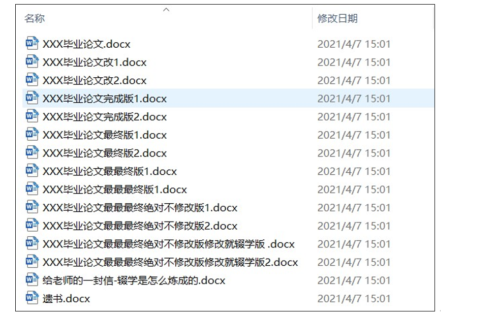


## 1.2 为什么要版本控制

个人开发过渡到团队协作。

举例说明: **没有版本控制**

- 红脸A从服务器上取了一份代码下来，进行修改
- 红脸A取下代码后，蓝脸B取了一份代码，进行修改
- 红脸A提交代码 服务器上位A的代码
- 蓝脸B提交代码 覆盖了红脸A提交的代码

代码覆盖原因:

- 蓝脸B与红脸A代码之间没有同步，只是对同一份文件进行修改，缺少俩份代码比较整合过程

版本控制:

- 处理的就是这种问题


## **1.3** 版本控制工具

### 1.3.1 集中式版本控制工具 

<font size=5>**CVS、SVN(Subversion)、VSS……**</font>

> 集中化的版本控制系统诸如 **CVS**、**SVN** 等，都有一个**单一的集中管理的服务器**，保存所有文件的修订版本,而协同工作的人们都通过客户端连到这台服务器，取出最新的文件或者提交更新。多年以来，这已成为版本控制系统的标准做法。 
>
> 

 **优点**

​	每个人都可以在一定程度上**看到项目中的其他人正在做些什么**。而管理员也可以轻松**掌控每个开发者的权限**，并且**管理一个集中化的版本控制系统，要远比在各个客户端上维护本地数据库来得轻松容易**。 

**缺点**

​	这么做显而易见的缺点是**中央服务器的单点故障**。如果服务器宕机一小时，那么在这一小时内，谁都无法提交更新，也就无法协同工作。


### 1.3.2 分布式版本控制工具

<font size=5>**Git**、Mercurial、Bazaar、Darcs…… </font>

#### Git版本控制原理

像 Git 这种分布式版本控制工具，客户端提取的不是最新版本的文件快照，而是<font size=5>**把代码仓库完整地镜像下来（本地库**）。**这样任何一处协同工作用的文件发生故障，事后都可以用其他客户端的本地仓库进行恢复**</font>。因为每个客户端的每一次文件提取操作，实际上都是一次对整个文件仓库的完整备份。

#### 分布 式版本好处

分布式的版本控制系统出现之后,解决了集中式版本控制系统的缺陷: 

1. 服务器断网的情况下也可以进行开发（因为版本控制是在本地进行的） 
2. 每个客户端保存的也都是整个完整的项目（包含历史记录，更加安全） 


## **1.4 Git** 简史 

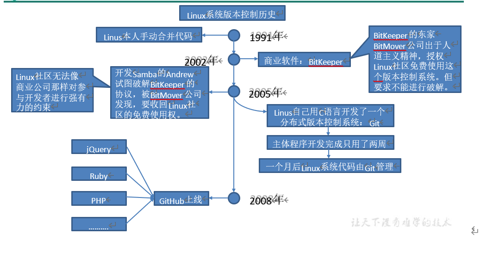

## **1.5 Git** 工作机制 

**工作机制**[^1]

- 工作区
  - 自己本地代码文件所存的地方，**没有纳入Git管理**
- 暂存区
  - add 工作区后，当前代码提交进入暂存区，**纳入Git管理**，文件是暂时存储
- 本地库
  - Git镜像复制的整份代码所处的本地位置 ，**纳入Git管理**，相当于本地文件服务器
- 远程仓库
  - **Gitee，Github**等托管平台服务器，用于存放你与其他开发人员的统一代码，在A与B各自push代码后，对AB代码进行合并。


### **1.6 Git** 和代码托管中心 

代码托管中心是基于网络服务器的远程代码仓库，一般我们简单称为远程库。

**➢ 局域网** 

- GitLab 	

**➢ 互联网** 

- GitHub（外网） 
-  Gitee 码云（国内网站） 

 

# 第**2**章 **Git** 安装

## 2.1 下载准备

​	根据 [官网地址]( https://git-scm.com/ ) 进行软件下载即可

## 2.2 安装教程

​     

- **查看 GNU 协议，可以直接点击下一步**

 


- **选择 Git 安装位置，要求是非中文并且没有空格的目录，然后下一步**

 


- **Git 选项配置，推荐默认设置，然后下一步**

- 

 


- **Git 安装目录名，不用修改，直接点击下一步。** 

 


- **Git 的默认编辑器，建议使用默认的 Vim 编辑器，然后点击下一步。** 

 


- **默认分支名设置，选择让 Git 决定，分支名默认为 master，下一步。** 

 


- **修改 Git 的环境变量，选第一个，不修改环境变量，只在 Git Bash 里使用 Git。** 

 


- **选择后台客户端连接协议，选默认值 OpenSSL，然后下一步。** 

 


- **配置 Git 文件的行末换行符，Windows 使用 CRLF，Linux 使用 LF，选择第一个自动转换，然后继续下一步。** 

 


**选择 Git 终端类型，选择默认的 Git Bash 终端，然后继续下一步。** 

 


**选择 Git pull 合并的模式，选择默认，然后下一步。** 

 


- **选择 Git 的凭据管理器，选择默认的跨平台的凭据管理器，然后下一步。** 

 


- **其他配置，选择默认设置，然后下一步。** 

 


- **实验室功能，技术还不成熟，有已知的 bug，不要勾选，然后点击右下角的 Install 按钮，开始安装 Git。**

 


- **点击 Finsh 按钮，Git 安装成功！** 

 


- **右键任意位置，在右键菜单里选择 Git Bash Here 即可打开 Git Bash 命令行终端。** 

 


- **在 Git Bash 终端里输入 git --version 查看 git 版本，如图所示，说明 Git 安装成功。** 

 

 

 

# 第 **3** 章 **Git** 常用命令

## **仓库指令**

| 命令名称                             | 作用               |
| ------------------------------------ | ------------------ |
| git config --global user.name 用户名 | 设置用户签名       |
| git config --global user.email 邮箱  | 设置用户签名       |
| **git init**                         | **初始化本地库**   |
| **git status**                       | **查看本地库状态** |
| **git add 文件名**                   | **添加到暂存区**   |
| **git commit -m "日志信息" 文件名**  | **提交到本地库**   |
| **git reflog**                       | **查看历史记录**   |
| **git reset --hard 版本号**          | **版本穿梭**       |

## 分支指令

| 命令名称                | 作用                         |
| ----------------------- | ---------------------------- |
| **git branch** 分支名   | 创建分支                     |
| **git brach -v**        | 查看分支                     |
| **git checkout** 分支名 | 切换分支                     |
| **git merge** 分支名    | 把指定的分支合并到当前分支上 |

## **3.1** 设置用户签名

### 3.1.1 基本语法 

```markdown
git config --global user.name 用户名 

git config --global user.email 邮箱 
```


### 3.1.2 案例实操全局范围的签名设置： 

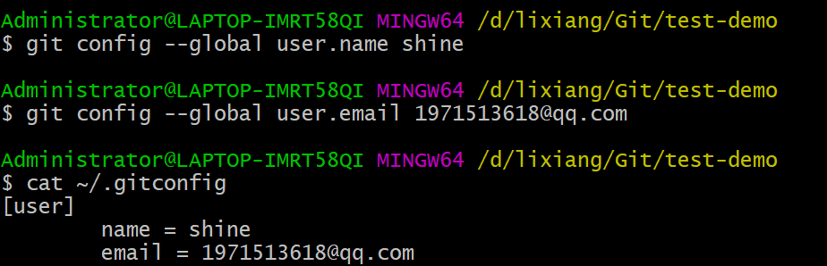

### 3.1.3 签名的作用 

- 签名的作用是**区分不同操作者身份**。
  - 用户的签名信息在每一个版本的提交信息中能够看到，以此确认本次提交是谁做的。
  - Git **首次安装必须设置一下用户签名，否则无法提交代码**。 
  - ※注意：这里设置用户签名和将来登录 GitHub（或其他代码托管中心）的账号没有任何关系。 

## **3.2** 初始化本地库  

#### **1）**基本语法 

```markdown
git init
```


#### **2）**案例实操 

1. 定位到需要本地代码的位置
2. 在对应文件夹下面执行 **git init**，建立git与电脑连接-本地库
3. 本地生成.git文件

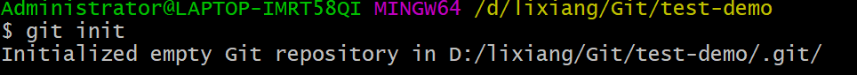

#### **3）**结果查看

当前文件夹下面有**.git**隐藏文件夹，表示初始化本地库成功

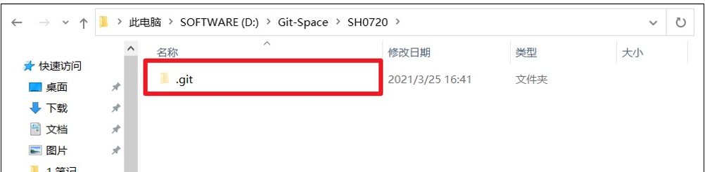

 

## **3.3** 查看本地库状态

### **1）**基本语法 

**git status** 

### **2）**案例实操 

#### **3.3.1** 首次查看（工作区没有任何文件） 

  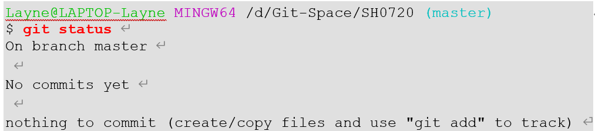

#### **3.3.2** 新增文件（**hello.txt**） 

  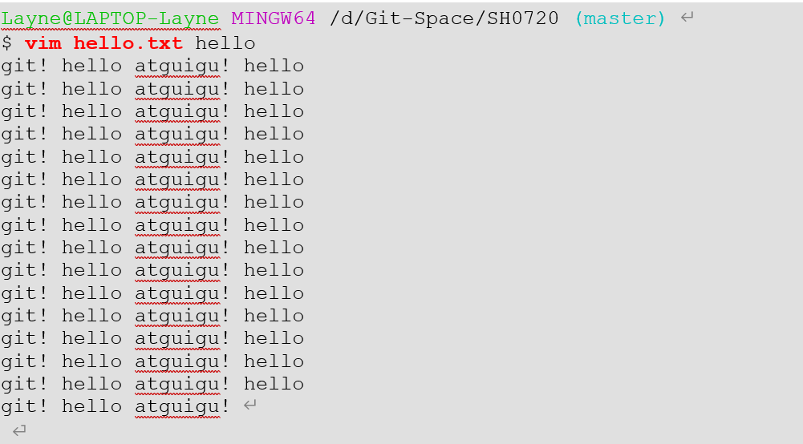

 

#### **3.3.3** 再次查看（检测到未追踪的文件） 

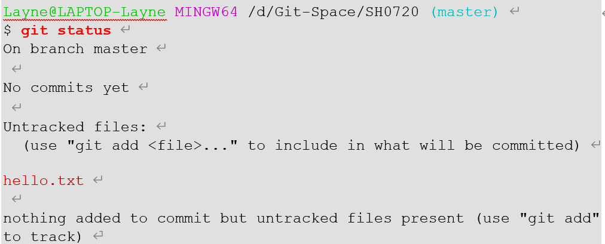

## **3.4** 添加暂存区 

### **1）**基本语法 

**git** **add** 文件名 

### **2）**案例实操 

#### 3.4.1 将工作区文件添加到暂存区

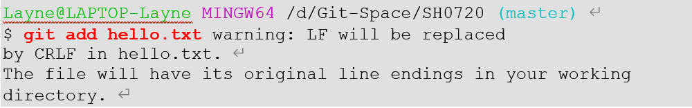

#### **3.4.2** 查看状态（检测到暂存区有新文件） 

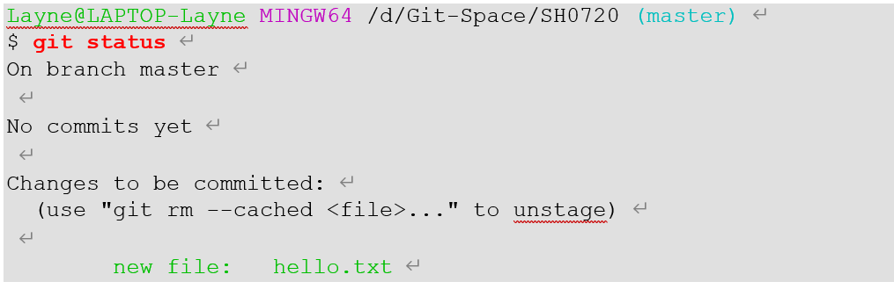

## **3.5** 提交本地库 

### **1）**基本语法 

<font size = 5>**git** **commit** **-m "**日志信息**"** 文件名</font>

### **2）**案例实操 

#### **3.5.1** 将暂存区的文件提交到本地库 

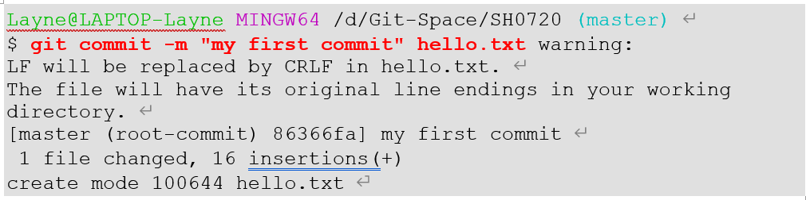

#### **3.5.2** 查看状态（没有文件需要提交） 


## **3.6** 修改文件（**hello.txt**） 

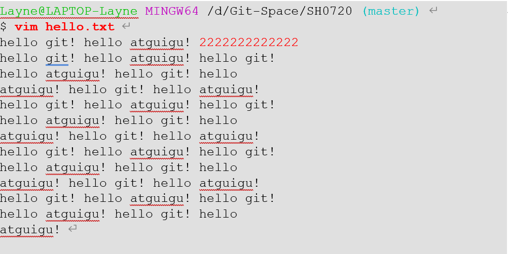

### **3.6.1** 查看状态（检测到工作区有文件被修改） 

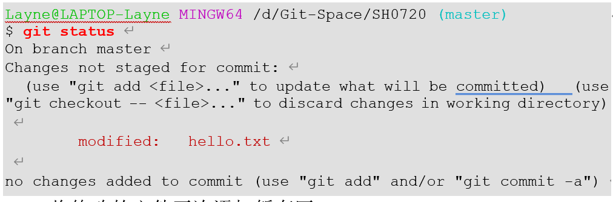

### **3.6.2** 将修改的文件再次添加暂存区 

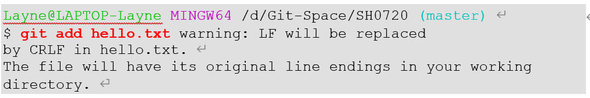  

### **3.6.3** 查看状态（工作区的修改添加到了暂存区） 


## **3.7** 历史版本 

### **1）**基本语法 

**git reflog** 查看版本信息

 **git log** 查看版本详细信息 

### **2）**案例实操 

#### **3.7.1** 查看历史版本

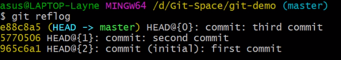

## **3.7.2** 版本穿梭 

### **1）**基本语法 

**git reset --hard** 版本号 

### **2）**案例实操 

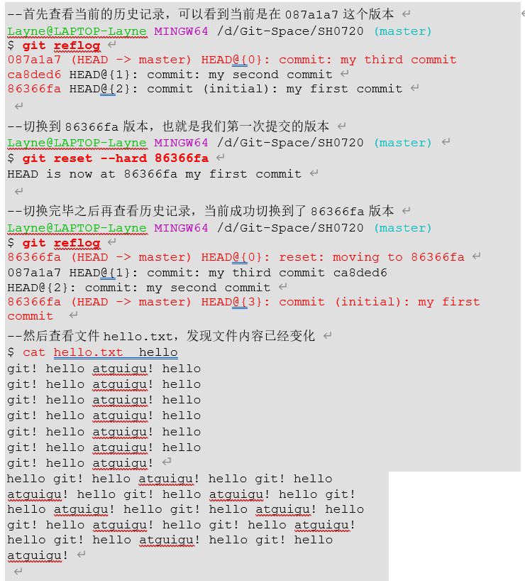

 

 

**Git 切换版本，底层其实是移动的 HEAD 指针，具体原理如下图所示。** [^2]

- 版本head指向当前所使用的分支(例如master)
- master指向代码版本信息
- **git reset --hard 版本号** 会让master指针指定对应的版本号


# 第 **4** 章 **Git** 分支操作


------

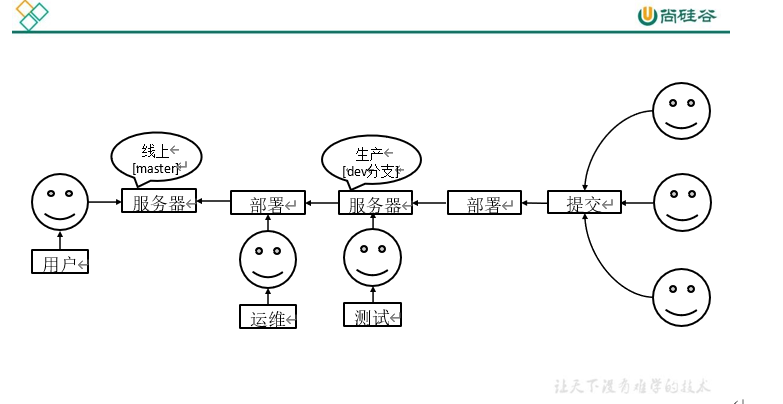

## **4.1** 什么是分支

在版本控制过程中，同时推进多个任务，为每个任务，我们就可以创建每个任务的单独分支。

使用分支**意味着程序员可以把自己的工作从开发主线上分离开来**，开发自己分支的时候，不会影响主线分支的运行。

对于初学者而言，分支可以简单理解为副本，一个分支就是一个单独的副本。（分支底层其实也是指针的引用） 

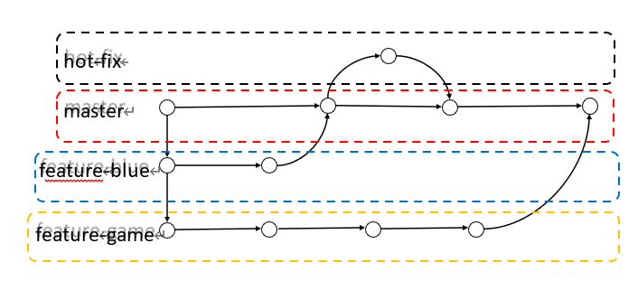

## **4.2** 分支的好处

**同时并行推进多个功能开发，提高开发效率**

- 各个分支在开发过程中，如果某一个分支开发失败，不会对其他分支有任何影响。失败的分支删除重新开始即可。 

## **4.3** 分支的操作 

| 命令名称                | 作用                         |
| ----------------------- | ---------------------------- |
| **git branch** 分支名   | 创建分支                     |
| **git brach -v**        | 查看分支                     |
| **git checkout** 分支名 | 切换分支                     |
| **git merge** 分支名    | 把指定的分支合并到当前分支上 |

### 4.3.1 查看分支

#### **1）**基本语法 

**git branch -v** 

#### **2）**案例实操 


### **4.3.2** 创建分支 

#### **1）**基本语法 

**git branch** 分支名 

#### **2）**案例实操 

创建分支的时候已经自动将当前代码进行克隆到当前分支上了

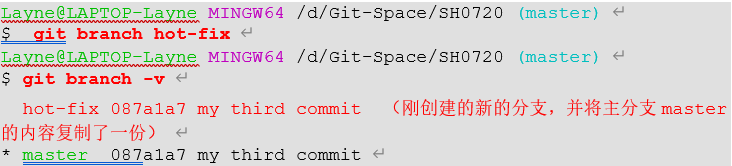

### **4.3.3** 修改分支 

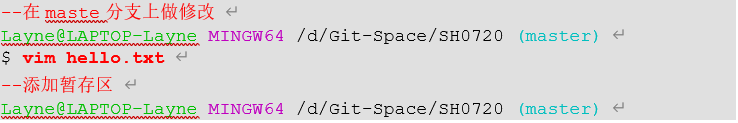

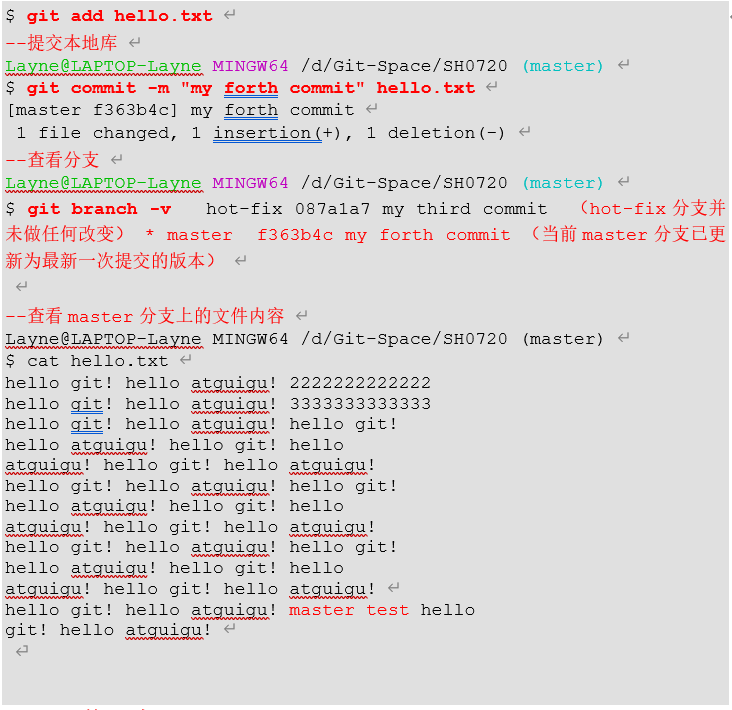

### **4.3.4** 切换分支 

#### **1）**基本语法 

**git checkout** 分支名 

#### **2）**案例实操 

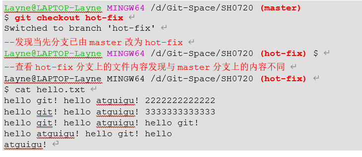

### **4.3.5** 合并分支 

#### **1）**基本语法 

**git merge** 分支名 

#### **2）**案例实操 在 **master** 分支上合并 **hot-fix** 分支 

  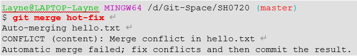

### **4.3.6** 产生冲突 

冲突产生的表现：后面状态为 <font color=red>**MERGING**</font>


 

<font size=5 color=red>冲突产生的原因：合并分支时，两个分支在**同一个文件的同一个位置**有两套完全不同的修改。Git 无法替我们决定使用哪一个。必须**人为决定**新代码内容。 查看状态（检测到有文件有两处修改)</font>

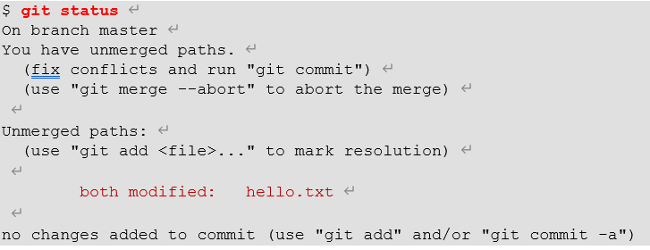

 

### **4.3.7** 解决冲突[^3]

1）编辑有冲突的文件，删除特殊符号，决定要使用的内容 

特殊符号：**<<<<<<< HEAD** 当前分支的代码 **=======** 合并过来的代码 **>>>>>>> hot-fix** 

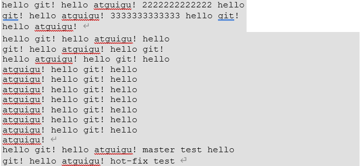

2）添加到暂存区 


$ **git add hello.txt** 

3）执行提交（注意：此时使用 **git commit 命令时不能带文件名**） 

因为此时俩个分支同时操作一个文件，导致冲突

 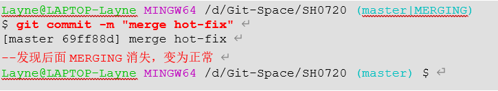

## **4.4** 创建分支和切换分支图解

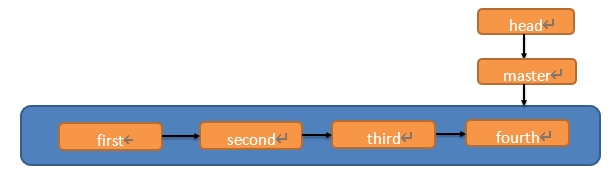

- <font color=red size=5>**Head指向分支**</font>

  

- <font color=red size=5>**分支指向版本记录**</font>


**master、hot-fix** 其实都是指向具体版本记录的指针。

当前所在的分支，其实是由 **HEAD**决定的，所以创建分支的本质就是多创建一个指针。 

**HEAD** 如果指向 **master**，那么我们现在就在 **master** 分支上。 

**HEAD** 如果执行 **hotfix**，那么我们现在就在 **hotfix** 分支上。 

所以切换分支的本质就是移动 **HEAD** 指针。 

# 第 **5** 章 **Git** 团队协作机制

## **5.1** 团队内协作 


## **5.2** 跨团队协作 


# 第 **6** 章 **GitHub** 操作

GitHub 网址[：](https://github.com/)https://github.com/[ ](https://github.com/)

Ps:全球最大同性交友网站，技术宅男的天堂，新世界的大门，你还在等什么?

| 账号               | 姓名     | 验证邮箱                   |
| ------------------ | -------- | -------------------------- |
| atguiguyueyue      | 岳不群   | atguiguyueyue@aliyun.com   |
| atguigulinghuchong | 令狐冲   | atguigulinghuchong@163.com |
| atguigudongfang1   | 东方不败 | atguigudongfang@163.com    |

注:此三个账号为讲师使用账号，同学请自行注册，然后三个同学为一组进行团队协作！ 


| 命令名称 |                                    | 作用 |                                                          |      |                                |      |      |      |      |      |      |
| -------- | ---------------------------------- | ---- | -------------------------------------------------------- | ---- | ------------------------------ | ---- | ---- | ---- | ---- | ---- | ---- |
|          | git remote -v                      |      |                                                          |      | 查看当前所有远程地址别名       |      |      |      |      |      |      |
|          | git remote add 别名 远程地址       |      |                                                          |      | 起别名                         |      |      |      |      |      |      |
|          | git push 别名 分支                 |      |                                                          |      | 推送本地分支上的内容到远程仓库 |      |      |      |      |      |      |
|          | git clone 远程地址                 |      |                                                          |      | 将远程仓库的内容克隆到本地     |      |      |      |      |      |      |
|          | git pull 远程库地址别名 远程分支名 |      | 将远程仓库对于分支最新内容拉下来后与当前本地分支直接合并 |      |                                |      |      |      |      |      |      |
|          |                                    |      |                                                          |      |                                |      |      |      |      |      |      |
|          |                                    |      |                                                          |      |                                |      |      |      |      |      |      |

 

## **6.2.1** 创建远程仓库别名 

**1）**基本语法 

**git remote -v** 查看当前所有远程地址别名 **git remote add** 别名 远程地址 

**2）**案例实操 

  Layne@LAPTOP-Layne MINGW64 /d/Git-Space/SH0720 (master) $ **git remote -v**   Layne@LAPTOP-Layne  MINGW64 /d/Git-Space/SH0720 (master)   $ **git remote add ori  https://github.com/atguiguyueyue/git-shTest.git**    Layne@LAPTOP-Layne  MINGW64 /d/Git-Space/SH0720 (master)   $ **git remote -v**   ori    https://github.com/atguiguyueyue/git-shTest.git (fetch) ori    https://github.com/atguiguyueyue/git-shTest.git (push)   

**https://github.com/atguiguyueyue/git-shTest.git**

这个地址在创建完远程仓库后生成的连接，如图所示红框中 


**1）**基本语法 

**git push** 别名 分支 

**2）**案例实操 

Layne@LAPTOP-Layne MINGW64 /d/Git-Space/SH0720 (master) 

$ **git push ori master** 

Logon failed, use ctrl+c to cancel basic credential prompt. Username for 'https://github.com': atguiguyueyue 

Counting objects: 3, done. 

Delta compression using up to 12 threads. 

Compressing objects: 100% (2/2), done. 

Writing objects: 100% (3/3), 276 bytes | 276.00 KiB/s, done. 

Total 3 (delta 0), reused 0 (delta 0) 

To https://github.com/atguiguyueyue/git-shTest.git 

 \* [new branch]   master -> master 

此时发现已将我们 master 分支上的内容推送到 GitHub 创建的远程仓库。 


## **6.2.3** 克隆远程仓库到本地 

**1）**基本语法 

**git clone** 远程地址 

**2）**案例实操 

  Layne@LAPTOP-Layne  MINGW64 /d/Git-Space/pro-linghuchong   $ **git clone  https://github.com/atguiguyueyue/git-shTest.git**   Cloning into  'git-shTest'...   remote: Enumerating objects: 3, done.  remote: Counting objects: 100% (3/3), done. remote: Compressing objects: 100%  (2/2), done.   remote:  Total 3 (delta 0), reused 3 (delta 0), pack-reused 0   Unpacking  objects: 100% (3/3), done.   

**https://github.com/atguiguyueyue/git-shTest.git**

  --创建远程仓库别名   Layne@LAPTOP-Layne  MINGW64 /d/Git-Space/pro-linghuchong/git-shTest  (master) $ git  remote -v origin   https://github.com/atguiguyueyue/git-shTest.git (fetch) origin   https://github.com/atguiguyueyue/git-shTest.git (push)   

这个地址为远程仓库地址，克隆结果：初始化本地仓库 

小结：clone 会做如下操作。1、拉取代码。2、初始化本地仓库。3、创建别名 

## **6.2.4** 邀请加入团队 

**1**）选择邀请合作者 


**3** ）复制地址并通过微信钉钉等方式发送给该用户，复制内容如下：

**https://github.com/atguiguyueyue/git-shTest/invitations**

 

**4）**在 **atguigulinghuchong** 这个账号中的地址栏复制收到邀请的链接，点击接受邀请。 


**5）**成功之后可以在 **atguigulinghuchong** 这个账号上看到 **git-Test** 的远程仓库。 


**6）**令狐冲可以修改内容并 **push** 到远程仓库。 

  --编辑clone下来的文件   Layne@LAPTOP-Layne MINGW64  /d/Git-Space/pro-linghuchong/git-shTest  (master)    $ vim hello.txt   Layne@LAPTOP-Layne MINGW64  /d/Git-Space/pro-linghuchong/git-shTest  (master) $ cat hello.txt   hello git! hello atguigu! 2222222222222 hello  git! hello atguigu! 33333333333333 hello git! hello atguigu! hello git! hello  atguigu! hello git! hello atguigu! 我是最帅的，比岳不群还帅 hello git! hello atguigu! hello git!  hello atguigu! hello git! hello atguigu! hello git! hello atguigu! hello git!  hello atguigu! hello git! hello atguigu! hello git! hello atguigu! hello git!  hello atguigu! hello git! hello atguigu!   hello git!  hello atguigu! master test   hello git!  hello atguigu! hot-fix test   --将编辑好的文件添加到暂存区   Layne@LAPTOP-Layne MINGW64  /d/Git-Space/pro-linghuchong/git-shTest  

(master) 

$ git add hello.txt

--将暂存区的文件上传到本地库 

Layne@LAPTOP-Layne MINGW64 /d/Git-Space/pro-linghuchong/git-shTest

(master) 

$ git commit -m "lhc commit" hello.txt 

[master 5dabe6b] lhc commit 

 1 file changed, 1 insertion(+), 1 deletion(-) 

--将本地库的内容push到远程仓库 

Layne@LAPTOP-Layne MINGW64 /d/Git-Space/pro-linghuchong/git-shTest

(master) 

$ git push origin master

Logon failed, use ctrl+c to cancel basic credential prompt. Username for 'https://github.com': atguigulinghuchong 

Counting objects: 3, done. 

Delta compression using up to 12 threads. 

Compressing objects: 100% (2/2), done. 

Writing objects: 100% (3/3), 309 bytes | 309.00 KiB/s, done. Total 3 (delta 1), reused 0 (delta 0) remote: Resolving deltas: 100% (1/1), completed with 1 local object. 

To https://github.com/atguiguyueyue/git-shTest.git  7cb4d02..5dabe6b master -> master 

**7**）回到 **atguiguyueyue** 的 **GitHub** 远程仓库中可以看到，最后一次是 **lhc** 提交的。 


## **6.2.5** 拉取远程库内容 

**1）**基本语法 

**git pull** 远程库地址别名 远程分支名 

**2）**案例实操 

  --将远程仓库对于分支最新内容拉下来后与当前本地分支直接合并   Layne@LAPTOP-Layne  MINGW64 /d/Git-Space/SH0720 (master)   $ **git pull ori master** remote: Enumerating objects: 5, done.  remote: Counting objects: 100% (5/5), done. remote: Compressing objects: 100%  (1/1), done.   remote:  Total 3 (delta 1), reused 3 (delta 1), pack-reused 0   Unpacking  objects: 100% (3/3), done.   From  https://github.com/atguiguyueyue/git-shTest    * branch      master   -> FETCH_HEAD     7cb4d02..5dabe6b master    -> ori/master   Updating 7cb4d02..5dabe6b  Fast-forward hello.txt | 2 +-    1 file changed, 1 insertion(+), 1  deletion(-)   Layne@LAPTOP-Layne  MINGW64 /d/Git-Space/SH0720 (master)   $ cat  hello.txt   hello git! hello atguigu! 2222222222222 hello  git! hello atguigu! 33333333333333 hello git! hello atguigu! hello git! hello  atguigu! hello git! hello atguigu! 我是最帅的，比岳不群还帅 hello git! hello atguigu! hello git!  hello atguigu! hello git! hello atguigu! hello git! hello atguigu! hello git!  hello atguigu! hello git! hello atguigu! hello git! hello atguigu! hello git!  hello atguigu! hello git! hello atguigu!   hello git! hello atguigu! master test hello git! hello  atguigu! hot-fix test   

## **6.3** 跨团队协作

**1）**将远程仓库的地址复制发给邀请跨团队协作的人，比如东方不败。 


**2）**在东方不败的 **GitHub** 账号里的地址栏复制收到的链接，然后点击 **Fork** 将项目叉到自己的本地仓库。

 


**3）**东方不败就可以在线编辑叉取过来的文件。


**4）**编辑完毕后，填写描述信息并点击左下角绿色按钮提交。 


**5）**接下来点击上方的 **Pull** 请求，并创建一个新的请求。 

 


**6）**回到岳岳 **GitHub** 账号可以看到有一个 **Pull request** 请求。 


进入到聊天室，可以讨论代码相关内容。


**7）**如果代码没有问题，可以点击 **Merge pull reque** 合并代码。 


我们可以看到远程仓库中还有一个 SSH 的地址，因此我们也可以使用 SSH 进行访问。 


--进入当前用户的家目录

Layne@LAPTOP-Layne MINGW64 /d/Git-Space/SH0720 (master) 

$ cd 

--删除.ssh目录

Layne@LAPTOP-Layne MINGW64 ~

$ rm -rvf .ssh removed '.ssh/known_hosts' 

  removed  directory '.ssh'   --运行命令生成.ssh秘钥目录[注意：这里-C这个参数是大写的C]   Layne@LAPTOP-Layne  MINGW64 ~   $ ssh-keygen -t rsa -C atguiguyueyue@aliyun.com   Generating  public/private rsa key pair.   Enter file  in which to save the key (/c/Users/Layne/.ssh/id_rsa):   Created  directory '/c/Users/Layne/.ssh'.   Enter  passphrase (empty for no passphrase):   Enter same  passphrase again:   Your  identification has been saved in /c/Users/Layne/.ssh/id_rsa.   Your public  key has been saved in /c/Users/Layne/.ssh/id_rsa.pub.   The key  fingerprint is:   SHA256:7CPfRLITKcYDhaqpEDeok7Atvwh2reRmpxxOC6dkY44  atguiguyueyue@aliyun.com   The key's  randomart image is:   +---[RSA  2048]----+   |   ..     |   |  ..      |   | . ..      |   |+ + o . .     |   |oO . = S .     |   |X . .. +  =    |   |+@ * .. =  .   |   |X.&o+.  o =    |   |Eo+Oo  . .     |   +----[SHA256]-----+    --进入.ssh目录查看文件列表   Layne@LAPTOP-Layne  MINGW64 ~   $ cd .ssh   Layne@LAPTOP-Layne  MINGW64 ~/.ssh   $ ll  -a  total 21 drwxr-xr-x 1 Layne 197609  0  11月 25 19:27 ./ drwxr-xr-x 1 Layne 197609    0 11月 25  19:27 ../   -rw-r--r-- 1  Layne 197609 1679 11月 25 19:27 id_rsa   -rw-r--r-- 1  Layne 197609 406 11月 25 19:27  id_rsa.pub   --查看id_rsa.pub文件内容   Layne@LAPTOP-Layne  MINGW64 ~/.ssh   $ cat id_rsa.pub   ssh-rsa   AAAAB3NzaC1yc2EAAAADAQABAAABAQDRXRsk9Ohtg1AXLltsuNRAGBsx3ypE1O1Rkdzpm  l1woa6y6G62lZri3XtCH0F7GQvnMvQtPISJFXXWo+jFHZmqYQa/6kOIMv2sszcoj2Qtwl  lGXTPn/4T2h/cHjSHfc+ks8OYP7OWOOefpOCbYY/7DWYrl89k7nQlfd+A1FV/vQmcsa1L  P5ihqjpjms2CoUUen8kZHbjwHBAHQHWRE+Vc371MG/dwINvCi8n7ibI86o2k0dW0+8SL+  svPV/Y0G9m+RAqgec8b9U6DcSSAMH5uq4UWfnAcUNagb/aJQLytrH0pLa8nMv3XdSGNNo  AGBFeW2+K81XrmkP27FrLI6lDef  atguiguyueyue@aliyun.com   

复制 id_rsa.pub 文件内容，登录 GitHub，点击用户头像→Settings→SSH and GPG keys 


接下来再往远程仓库 push 东西的时候使用 SSH 连接就不需要登录了。 

# 第 **7** 章 **IDEA** 集成 **Git**

## **7.1** 配置 **Git** 忽略文件 


问题 **1:**为什么要忽略他们？答：与项目的实际功能无关，不参与服务器上部署运行。把它们忽略掉能够屏蔽 IDE 工具之间的差异。 

问题 **2**：怎么忽略？ 

### 1）创建忽略规则文件 xxxx.ignore（前缀名随便起，建议是 git.ignore） 

这个文件的存放位置原则上在哪里都可以，为了便于让~/.gitconfig 文件引用，建议也放在用户家目录下 

git.ignore 文件模版内容如下： 

\# Compiled class file 

*.class 

| # Log file   *.log      # BlueJ files   *.ctxt      # Mobile Tools for Java (J2ME)   .mtj.tmp/      # Package Files #   *.jar   *.war   *.nar   *.ear   *.zip   *.tar.gz   *.rar      #     virtual     machine   http://www.java.com/en/download/help/error_hotspot.xml  hs_err_pid*      .classpath   .project .settings target .idea   *.iml | crash | logs, | see  |
| ------------------------------------------------------------ | ----- | ----- | ---- |
|                                                              |       |       |      |

2）在.gitconfig 文件中引用忽略配置文件（此文件在 Windows 的家目录中） 

  [user]   name = Layne    email = Layne@atguigu.com   [core]   excludesfile = C:/Users/asus/git.ignore   注意：这里要使用“正斜线（/）”，不要使用“反斜线（\）”   

## **7.2** 定位 **Git** 程序 


选择要创建 Git 本地仓库的工程。 


右键点击项目选择 Git -> Add 将项目添加到暂存区。 


### **7.5** 提交到本地库 


在 IDEA 的左下角，点击 Version Control，然后点击 Log 查看版本 


右键选择要切换的版本，然后在菜单里点击 Checkout Revision。 


### **7.7** 创建分支

选择 Git，在 Repository 里面，点击 Branches 按钮。 


在弹出的 Git Branches 框里，点击 New Branch 按钮。 


填写分支名称，创建 hot-fix 分支。 


 然后再 IDEA 的右下角看到 hot-fix，说明分支创建成功，并且当前已经切换成 hot-fix 分

支 


在 IDEA 窗口的右下角，切换到 master 分支。 


然后在 IDEA 窗口的右下角看到了 master，说明 master 分支切换成功。 


### **7.9** 合并分支

在 IDEA 窗口的右下角，将 hot-fix 分支合并到当前 master 分支。 


如果代码没有冲突，分支直接合并成功，分支合并成功以后，代码自动提交，无需手动

提交本地库。 


如图所示，如果 master 分支和 hot-fix 分支都修改了代码，在合并分支的时候就会发生冲突。 


我们现在站在 master 分支上合并 hot-fix 分支，就会发生代码冲突。 


 点击 Conflicts 框里的 Merge 按钮，进行手动合并代码。 


 手动合并完代码以后，点击右下角的 Apply 按钮。 


 

# 第 **8** 章 **IDEA** 集成 **GitHub** 


如果出现 401 等情况连接不上的，是因为网络原因，可以使用以下方式连接： 


然后去 GitHub 账户上设置 token。 


点击登录。 


## **8.2** 分享工程到 **GitHub** 


 

来到 GitHub 中发现已经帮我们创建好了 gitTest 的远程仓库。 


右键点击项目，可以将当前分支的内容 push 到 GitHub 的远程仓库中。 


注意：push 是将本地库代码推送到远程库，如果本地库代码跟远程库代码版本不一致， push 的操作是会被拒绝的。也就是说，要想 push 成功，一定要保证本地库的版本要比远程库的版本高！因此一个成熟的程序员在动手改本地代码之前，一定会先检查下远程库跟本地代码的区别！如果本地的代码版本已经落后，切记要先 pull 拉取一下远程库的代码，将本地

代码更新到最新以后，然后再修改，提交，推送！ 

 

### **8.4 pull** 拉取远程库到本地库 

右键点击项目，可以将远程仓库的内容 pull 到本地仓库。 


注意：pull 是拉取远端仓库代码到本地，如果远程库代码和本地库代码不一致，会自动合并，如果自动合并失败，还会涉及到手动解决冲突的问题。 

### **8.5 clone** 克隆远程库到本地 


为 clone 下来的项目创建一个工程，然后点击 Next。 


## 第 **9** 章 国内代码托管中心**-**码云 

### **9.1** 简介 

众所周知，GitHub 服务器在国外，使用 GitHub 作为项目托管网站，如果网速不好的话，严重影响使用体验，甚至会出现登录不上的情况。针对这个情况，大家也可以使用国内的项目托管网站-码云。 

码云是开源中国推出的基于 [Git](https://link.jianshu.com/?t=http://www.liaoxuefeng.com/wiki/0013739516305929606dd18361248578c67b8067c8c017b000/001373962845513aefd77a99f4145f0a2c7a7ca057e7570000) [的](https://link.jianshu.com/?t=http://www.liaoxuefeng.com/wiki/0013739516305929606dd18361248578c67b8067c8c017b000/001373962845513aefd77a99f4145f0a2c7a7ca057e7570000)代码托管服务中心，网址是 https://gitee.com/ ，使用方式跟 GitHub 一样，而且它还是一个中文网站，如果你英文不是很好它是最好的选择。 

#### **9.2** 码云帐号注册和登录 

进入码云官网地址：https://gitee.com/[，](https://gitee.com/)点击注册 Gitee 


 帐号注册成功以后，直接登录。 


点击首页右上角的加号，选择下面的新建仓库 


填写仓库名称，路径和选择是否开源（共开库或私有库） 


最后根据需求选择分支模型，然后点击创建按钮。 


远程库创建好以后，就可以看到 HTTPS 和 SSH 的链接。 


##### **9.4.1 IDEA** 安装码云插件 

Idea 默认不带码云插件，我们第一步要安装 Gitee 插件。 

如图所示，在 Idea 插件商店搜索 Gitee，然后点击右侧的 Install 按钮。 


Idea 链接码云和链接 GitHub 几乎一样，安装成功后，重启 Idea。 


   Idea 重启以后在 Version Control 设置里面看到 Gitee，说明码云插件安装成功。 


 然后在码云插件里面添加码云帐号，我们就可以用 Idea 连接码云了。 


##### **9.4.2 IDEA** 连接码云 

Idea 连接码云和连接 GitHub 几乎一样，首先在 Idea 里面创建一个工程，初始化 git 工程，然后将代码添加到暂存区，提交到本地库，这些步骤上面已经讲过，此处不再赘述。 


给远程库链接定义个 name，然后再 URL 里面填入码云远程库的 HTTPS 链接即可。码云服务器在国内，用 HTTPS 链接即可，没必要用 SSH 免密链接。 


然后选择定义好的远程链接，点击 Push 即可。 


看到提示就说明 Push 远程库成功。 


去码云远程库查看代码。 


只要码云远程库链接定义好以后，对码云远程库进行 pull 和 clone 的操作和 Github 一致，此处不再赘述。 

### **9.5** 码云复制 **GitHub** 项目 

码云提供了直接复制 GitHub 项目的功能，方便我们做项目的迁移和下载。 

具体操作如下： 


 将 GitHub 的远程库 HTTPS 链接复制过来，点击创建按钮即可。 


如果 GitHub 项目更新了以后，在码云项目端可以手动重新同步，进行更新！ 


## 第 **10** 章 自建代码托管平台**-GitLab**

### **10.1 GitLab** 简介

GitLab 是由 GitLabInc.开发，使用 [MIT](https://baike.baidu.com/item/MIT许可证) [许可证的](https://baike.baidu.com/item/MIT许可证)基于[网络的](https://baike.baidu.com/item/网络) [Git](https://baike.baidu.com/item/Git) [仓库管](https://baike.baidu.com/item/仓库)理工具，且具有 [wiki](https://baike.baidu.com/item/wiki) [和](https://baike.baidu.com/item/wiki) issue 跟踪功能。使用 [Git](https://baike.baidu.com/item/Git) [作](https://baike.baidu.com/item/Git)为代码管理工具，并在此基础上搭建起来的 web 服务。 

GitLab 由乌克兰程序员 DmitriyZaporozhets 和 ValerySizov 开发，它使用 [Ruby](https://baike.baidu.com/item/Ruby语言) [语言写](https://baike.baidu.com/item/Ruby语言)

成。后来，一些部分用 [Go](https://baike.baidu.com/item/Go语言) [语言重](https://baike.baidu.com/item/Go语言)写。截止 2018 年 5 月，该公司约有 290 名团队成员，以

及 2000 多名开源贡献者。GitLab 被 IBM，Sony，JülichResearchCenter，NASA，Alibaba，

Invincea，O’ReillyMedia，Leibniz-Rechenzentrum(LRZ)，CERN，SpaceX 等组织使用。 

### **10.2 GitLab** 官网地址

官网地址：https://about.gitlab.com/ 安装说明：https://about.gitlab.com/installation/[ ](https://about.gitlab.com/installation/)

### **10.3 GitLab** 安装

#### **10.3.1** 服务器准备 

准备一个系统为 CentOS7 以上版本的服务器，要求内存 4G，磁盘 50G。关闭防火墙，并且配置好主机名和 IP，保证服务器可以上网。 

此教程使用虚拟机：主机名：gitlab-server IP 地址：192.168.6.200 

#### **10.3.2** 安装包准备 

Yum 在线安装 gitlab- ce 时，需要下载几百 M 的安装文件，非常耗时，所以最好提前把所需 RPM 包下载到本地，然后使用离线 rpm 的方式安装。下载地址： 

https://packages.gitlab.com/gitlab/gitlabce/packages/el/7/gitlab-ce-13.10.2-ce.0.el7.x86_64.rpm

注：资料里提供了此 rpm 包，直接将此包上传到服务器/opt/module 目录下即可。 

##### **10.3.3** 编写安装脚本

安装 gitlab 步骤比较繁琐，因此我们可以参考官网编写 gitlab 的安装脚本。 

[root@gitlab-server module]# vim gitlab-install.sh sudo rpm -ivh /opt/module/gitlab-ce-13.10.2-ce.0.el7.x86_64.rpm 

 

sudo yum install -y curl policycoreutils-python openssh-server cronie sudo lokkit -s http -s ssh 

 

sudo yum install -y postfix 

 

sudo service postfix start 

 

sudo chkconfig postfix on 

 

curl https://packages.gitlab.com/install/repositories/gitlab/gitlabce/script.rpm.sh | sudo bash 

 

sudo EXTERNAL_URL="http://gitlab.example.com" yum -y install gitlabce 

 

给脚本增加执行权限 

  [root@gitlab-server  module]# chmod +x gitlab-install.sh   [root@gitlab-server module]# ll 总用量 403104   -rw-r--r--.  1 root root 412774002 4月  7 15:47  gitlab-ce-13.10.2ce.0.el7.x86_64.rpm   -rwxr-xr-x.  1 root root    416 4月  7 15:49 gitlab-install.sh   

然后执行该脚本，开始安装 gitlab-ce。注意一定要保证服务器可以上网。 

  [root@gitlab-server module]#  ./gitlab-install.sh 警告：/opt/module/gitlab-ce-13.10.2-ce.0.el7.x86_64.rpm:  头V4 RSA/SHA1  Signature, 密钥 ID  f27eab47: NOKEY 准备中...               #################################   [100%]   正在升级/安装...     1:gitlab-ce-13.10.2-ce.0.el7    #################################  [100%] 。  。 。  。 。  。   

**10.3.4** 初始化 **GitLab** 服务执行以下命令初始化 GitLab 服务，过程大概需要几分钟，耐心等待…

  [root@gitlab-server module]#  gitlab-ctl reconfigure   。  。 。  。 。  。   Running  handlers:   Running  handlers complete   Chef Client finished, 425/608 resources updated in 03 minutes 08 seconds gitlab Reconfigured!   

#### **10.3.5** 启动 **GitLab** 服务 

执行以下命令启动 GitLab 服务，如需停止，执行 gitlab-ctl stop 

[root@gitlab-server module]# gitlab-ctl start ok: run: alertmanager: (pid 6812) 134s ok: run: gitaly: (pid 6740) 135s ok: run: gitlab-monitor: (pid 6765) 135s 

ok: run: gitlab-workhorse: (pid 6722) 136s ok: run: logrotate: (pid 5994) 197s ok: run: nginx: (pid 5930) 203s ok: run: node-exporter: (pid 6234) 185s ok: run: postgres-exporter: (pid 6834) 133s ok: run: postgresql: (pid 5456) 257s ok: run: prometheus: (pid 6777) 134s ok: run: redis: (pid 5327) 263s ok: run: redis-exporter: (pid 6391) 173s ok: run: sidekiq: (pid 5797) 215s ok: run: unicorn: (pid 5728) 221s 

 

 

**10.3.6** 使用浏览器访问 **GitLab** 使用主机名或者 IP 地址即可访问 GitLab 服务。需要提前配一下 windows 的 hosts 文件。 


 首次登陆之前，需要修改下 GitLab 提供的 root 账户的密码，要求 8 位以上，包含大小写子母和特殊符号。因此我们修改密码为 Atguigu.123456 然后使用修改后的密码登录 GitLab。 


#### **10.3.7 GitLab** 创建远程库 


➢ 1）安装 GitLab 插件 


➢ 2）设置 GitLab 插件 


➢ 3）push 本地代码到 GitLab 远程库 


 自定义远程连接 


注意：gitlab 网页上复制过来的连接是：[http://](http://gitlab.example.com/root/git-test.git)[gitlab.example.com](http://gitlab.example.com/root/git-test.git)[/root/git](http://gitlab.example.com/root/git-test.git)[-](http://gitlab.example.com/root/git-test.git)[test.git](http://gitlab.example.com/root/git-test.git)[，](http://gitlab.example.com/root/git-test.git)需要手动修改为：[http:/](http://gitlab-server/root/git-test.git)[/gitlab](http://gitlab-server/root/git-test.git)[-](http://gitlab-server/root/git-test.git)[server](http://gitlab-server/root/git-test.git)[/root/git](http://gitlab-server/root/git-test.git)[-](http://gitlab-server/root/git-test.git)[test.git](http://gitlab-server/root/git-test.git)[ ](http://gitlab-server/root/git-test.git)

 选择 gitlab 远程连接，进行 push。 


 首次向连接 gitlab，需要登录帐号和密码，用 root 帐号和我们修改的密码登录即可。 


代码 Push 成功。 


只要 GitLab 的远程库连接定义好以后，对 GitLab 远程库进行 pull 和 clone 的操作和

Github 和码云一致，此处不再赘述。 